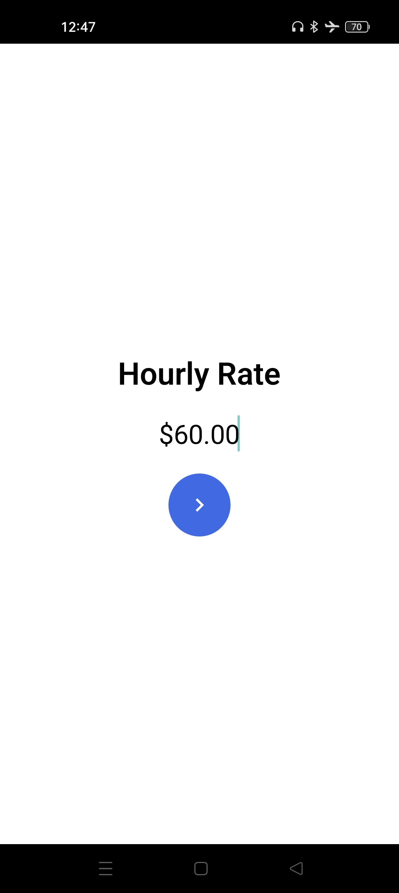
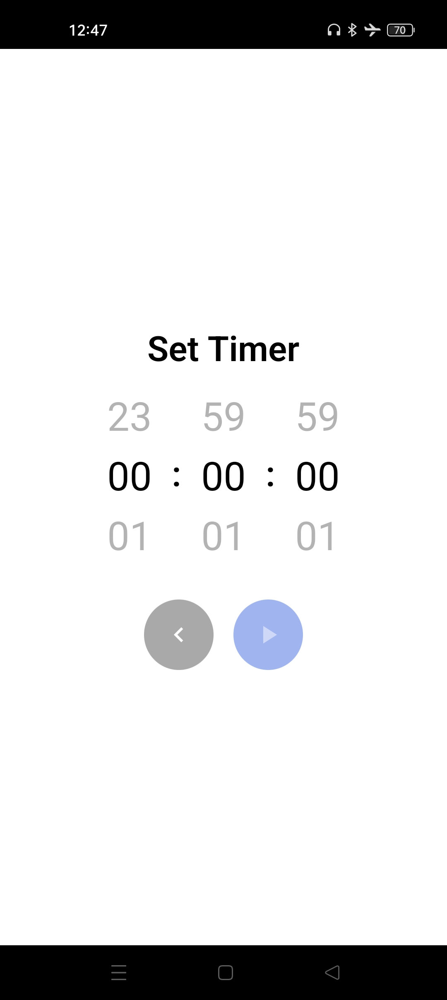
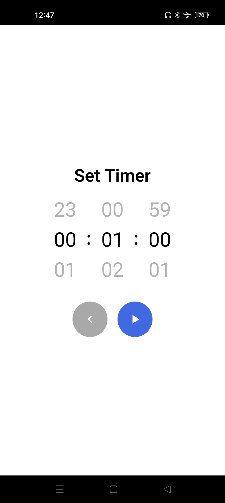
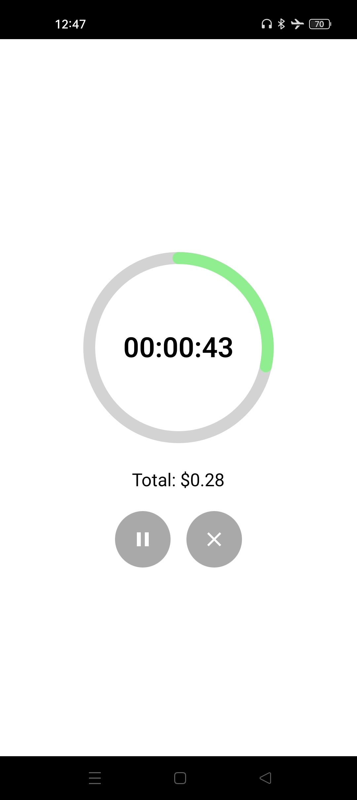

# RN Earnings Timer
A React Native earnings timer with start, pause, resume, reset, and real‑time income tracking. Built with React Native, TypeScript, Notifee, and React Navigation.

## Demo

### Screenshots
<div style="display: flex; flex-wrap: wrap; gap: 16px;">
  
  
  
  
  
  
</div>

### Video


## Features
- Start, pause, resume and reset the timer
- Real‑time earnings calculation
- Foreground and background notifications powered by Notifee

## How It Works
- User enters hourly rate and duration
- App calculates total seconds and expected earnings
- A finish timestamp is generated and tracked
- UI updates based on system time for accuracy
- Notifications fire when timer completes
- Pause/resume/reset adjusts the finish timestamp correctly

## Tech Stack
- React Native (CLI)
- TypeScript
- Notifee (local notifications)
- React Navigation

## Installation
```bash
npm install
npm start                 # starts Metro
npx react-native run-android   # builds and runs the Android app
```

## Usage 
- Enter your hourly rate and timer duration
- Start the timer to track real‑time earnings
- Pause, resume, or reset as needed
- Receive a notification when the timer completes

## Future Improvements
- Add iOS support
- Add history of completed timers
- Add dark mode
